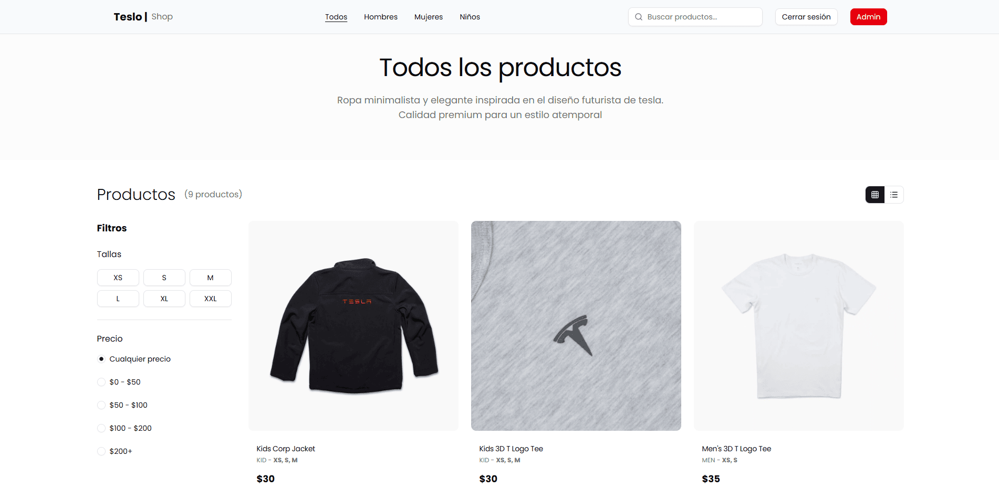
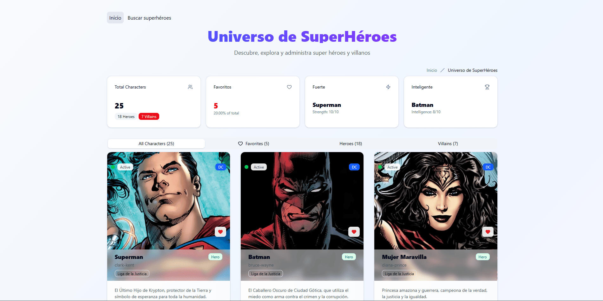
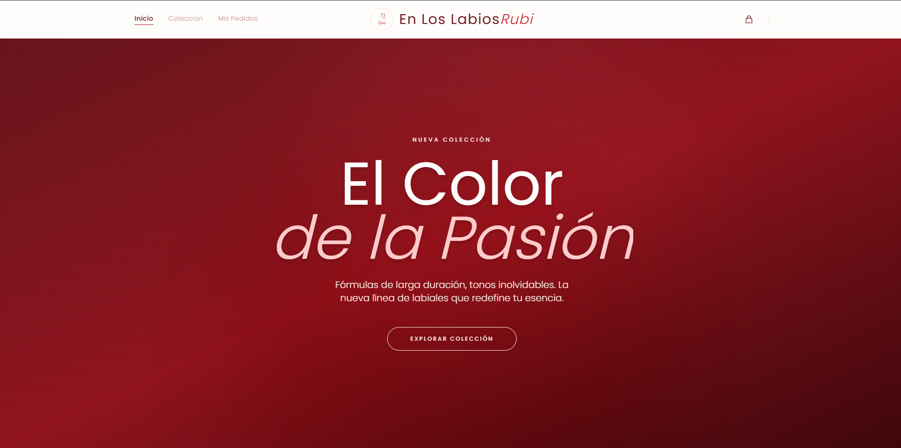
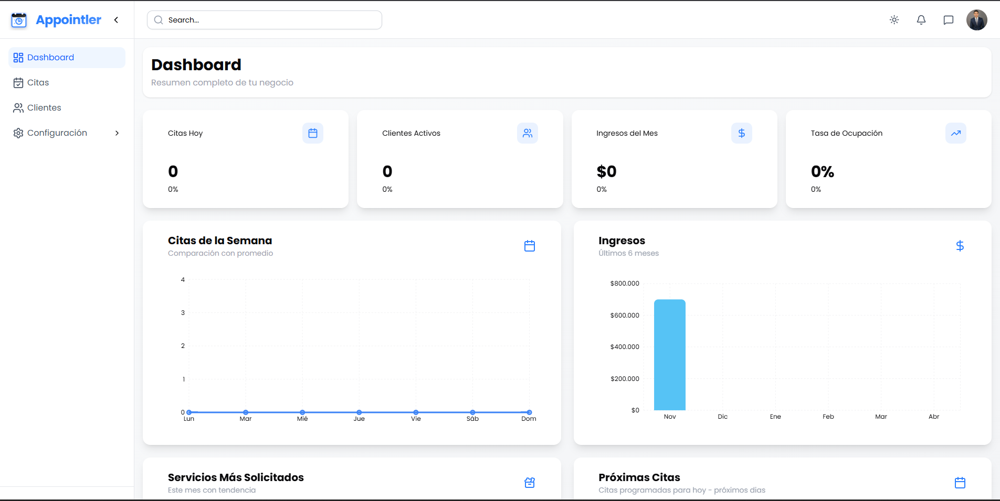

# Luis Bustamante | Portfolio Full Stack

[](https://my-portfolio-luisangel.vercel.app/)
[](https://www.linkedin.com/in/luis-angel-bustamante-herazo-30882a258/)
[](https://github.com/LuisAngel016)

Portfolio personal desarrollado con React, TypeScript, Vite y Tailwind CSS para presentar mi perfil profesional, experiencia y proyectos destacados como desarrollador Full Stack.

## Stack


## Vista previa


## Sobre el proyecto

Este sitio concentra mi propuesta profesional en una sola experiencia:

- Presentacion personal y perfil profesional
- Seccion de habilidades tecnicas
- Showcase de proyectos reales
- Enlaces a GitHub, LinkedIn y CV
- Formulario de contacto

## Proyectos destacados

### TesloShop

E-commerce desarrollado con React y NestJS.

- Demo: `https://teslo-shop-frontend-lb.netlify.app/#/`
- Credenciales: `test1@google.com / Abc123`
- Preview:



### Heroes App

Aplicacion de gestion de heroes desarrollada con React y NestJS.

- Demo: `https://heroes-app-universe.netlify.app/#/`
- Preview:



### En Los Labios Rubi

E-commerce de belleza con foco en identidad visual, catalogo y experiencia de compra.

- Demo: `https://enloslabiosrubi.com/`
- Preview:



### Appointler

SaaS para gestion de citas con landing publica y panel administrativo para el negocio.

- Demo: `https://appointler.netlify.app/`
- Landing:


- Admin:



## Secciones del portfolio

- Inicio
- Sobre mi
- Habilidades
- Proyectos
- Contacto

## Instalacion

```bash
npm install
```

## Desarrollo local

```bash
npm run dev
```

## Scripts disponibles

```bash
npm run dev
npm run build
npm run lint
npm run preview
```

## Estructura principal

```text
src/
  components/
  hooks/
  lib/
  styles/
public/
  images/
```

## Enlaces

- Portfolio: `https://my-portfolio-luisangel.vercel.app/`
- LinkedIn: `https://www.linkedin.com/in/luis-angel-bustamante-herazo-30882a258/`
- GitHub: `https://github.com/LuisAngel016`
- CV: `https://drive.google.com/file/d/1Jogra6jz__lh4w9tSg83w590c12waToj/view?usp=sharing`

## Autor

Luis Bustamante
