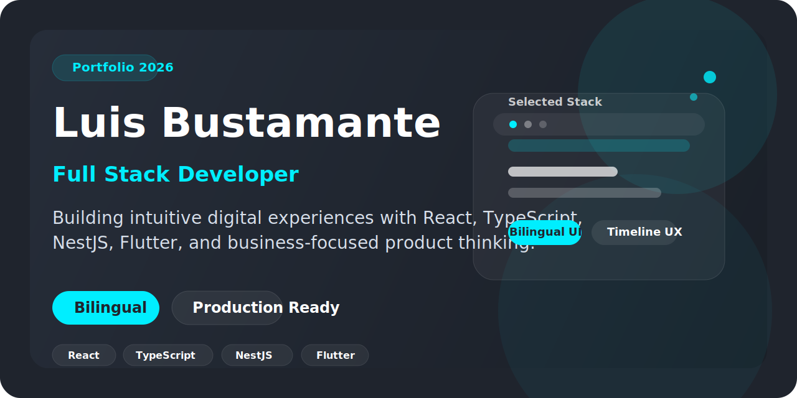

# Luis Bustamante | Full Stack Portfolio



[](https://luisangel.vercel.app/)
[](https://www.linkedin.com/in/luis-angel-bustamante-herazo-30882a258/)
[](https://github.com/LuisAngel016)

## ES

Portfolio personal desarrollado con React, TypeScript, Vite y Tailwind CSS para presentar mi perfil profesional, experiencia, stack y proyectos reales como desarrollador Full Stack.

### Stack


### Que muestra este portfolio

- Presentacion personal bilingue ES/EN
- Seccion About con propuesta de valor y highlights profesionales
- Seccion Experience con timeline premium, chips de stack y logros
- Showcase de proyectos reales con previews
- Contacto directo, CV y enlaces profesionales

### Proyectos destacados

#### TesloShop

- Demo: `https://teslo-shop-frontend-lb.netlify.app/#/`
- Credenciales: `test1@google.com / Abc123`


#### Heroes App

- Demo: `https://heroes-app-universe.netlify.app/#/`


#### En Los Labios Rubi

- Demo: `https://enloslabiosrubi.com/`


#### Appointler

- Demo: `https://appointler.netlify.app/`


### Desarrollo local

```bash
npm install
npm run dev
```

### Scripts

```bash
npm run dev
npm run build
npm run lint
npm run preview
```

## EN

Personal portfolio built with React, TypeScript, Vite, and Tailwind CSS to showcase my professional profile, experience, stack, and real-world projects as a Full Stack Developer.

### Stack


### What this portfolio includes

- Bilingual ES/EN presentation
- About section with value proposition and professional highlights
- Premium Experience section with timeline, stack chips, and impact points
- Real project showcase with previews
- Direct contact, CV, and professional links

### Featured projects

#### TesloShop

- Demo: `https://teslo-shop-frontend-lb.netlify.app/#/`
- Credentials: `test1@google.com / Abc123`


#### Heroes App

- Demo: `https://heroes-app-universe.netlify.app/#/`


#### En Los Labios Rubi

- Demo: `https://enloslabiosrubi.com/`


#### Appointler

- Demo: `https://appointler.netlify.app/`


### Local development

```bash
npm install
npm run dev
```

### Scripts

```bash
npm run dev
npm run build
npm run lint
npm run preview
```

## Links

- Portfolio: `https://luisangel.vercel.app/`
- LinkedIn: `https://www.linkedin.com/in/luis-angel-bustamante-herazo-30882a258/`
- GitHub: `https://github.com/LuisAngel016`
- CV: `https://drive.google.com/file/d/1Jogra6jz__lh4w9tSg83w590c12waToj/view?usp=sharing`
